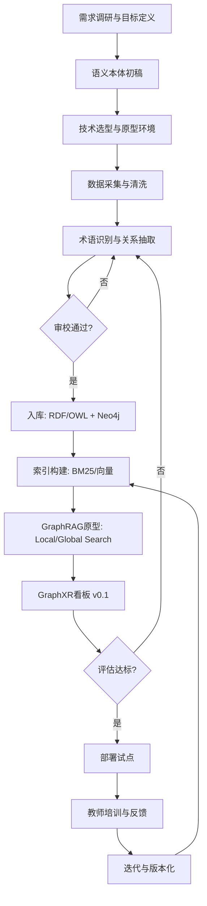
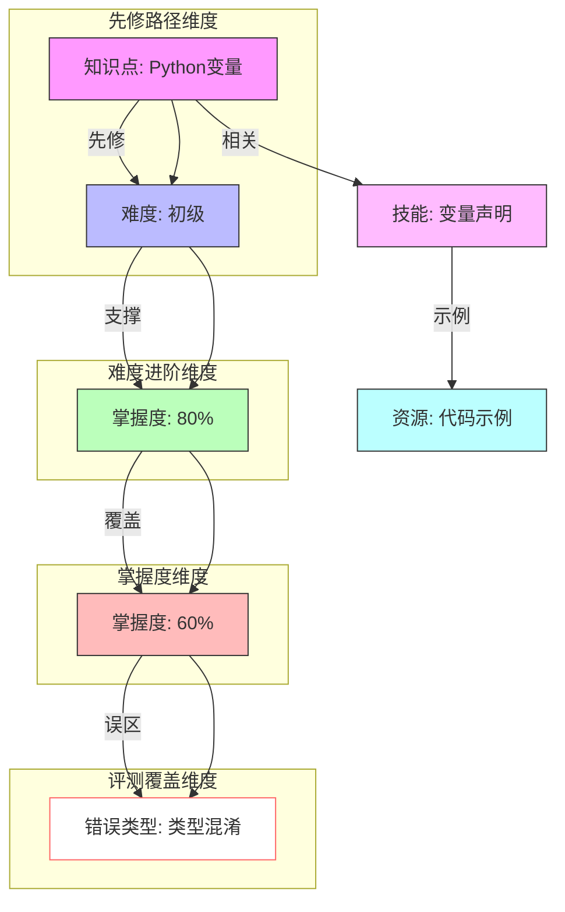

# 教育改革项目开发计划：本科《Python程序设计》知识图谱 × GraphRAG × GraphXR

## 1. 项目概述
- 面向本科《Python程序设计》课程，构建覆盖概念、技能、先修关系、学习目标与评测的教育知识图谱。
- 以 GraphRAG 提升教学资源与答疑的精准检索、社区摘要与可解释问答能力。
- 采用 GraphXR 打造多维可视化与交互分析看板，支持教学决策与学习路径规划。

## 2. 核心目标与价值
- 建立课程级语义本体，标准化“知识点—技能—目标—评测—资源”的映射。
- 通过 GraphRAG 的文本单元、实体、关系、社区与全局摘要机制，提供有依据的答案与来源引用。
- 以多维可视化呈现“先修依赖—难度进阶—掌握度—评测覆盖”四大维度，辅助教学改进。
- 支持学习路径推荐、薄弱环节诊断与教学资源重组，提升学习效果与教学效率。

## 3. 适用场景
- 教学备课与课程重构：基于图谱的目标对齐与资源编排。
- 学生自学与答疑：基于 GraphRAG 的局部检索、全局检索与可解释答案（带引用与路径）。
- 教学质量评估：评测覆盖率、先修合理性、一致性与学习成效分析。
- 教学管理决策：知识点热力、学习路径阻塞点与资源使用分析。

## 4. 总体架构（逻辑视图）
- 数据层：课程大纲、教材/PPT、教案、实验指导、OJ题库、作业与报告、视频与笔记。
- 处理层：清洗分段、文本单元切分、实体抽取、关系抽取、社区发现、摘要生成与人工审校。
- 图谱层：概念/技能/目标/评测/资源实体；先修、包含、关联、覆盖、支撑等关系。
- 存储层：
  - 语义三元组存储（RDF/OWL，便于规则与推理）
  - 交互图数据库（Neo4j，便于 GraphXR 可视化与高效遍历）
- 索引层：文本单元索引、实体索引、关系索引、社区索引与向量索引。
- GraphRAG 服务层：局部检索（Local Search）、全局检索（Global Search）、社区摘要与答案生成（带引用）。
- 可视化层：GraphXR 看板（多维分析、交互筛选、路径演示、热力与时间维）。
- 应用层：教学门户/API、问答助手、路径推荐、质量评估与报表。

## 5. 语义本体设计（课程级）
- 核心实体：
  - 知识点（Concept）、技能（Skill）、学习目标（LO）、评测项（AssessmentItem）、资源（Resource）
  - 课程（Course）、章节（Chapter）、示例/案例（Example）、错误类型（ErrorType）
- 关键关系：
  - 先修（Prerequisite）、包含（PartOf）、相关（RelatedTo）、等价/对齐（EquivalentTo/AlignedWith）
  - 支撑目标（SupportsLO）、覆盖评测（CoversAssessment）、示例说明（ExplainedBy）
  - 难度进阶（DifficultyProgression）、误区关联（LeadsToError）、依赖库（DependsOnLibrary）
- 关键属性：难度、重要度、掌握度、出现频次、教材页码、资源类型、评测权重。
- 教学对齐：每个学习目标与知识点-技能-评测项一一映射可追踪。

## 6. 数据采集与处理流程
- 采集：课程大纲、教材章节与页码、PPT、实验指导、OJ/作业、视频文字稿、常见错误集。
- 清洗与分段：章节/小节/知识点粒度切分，规范术语与别名；生成 GraphRAG 所需的 TextUnit 与资源元数据。
- 抽取：
  - 术语识别与别名合并（NLP + 规则）
  - 关系抽取（先修/包含/关联/覆盖/支撑等）
  - 评测映射（题目→知识点/技能→学习目标）
- 审校与版本：专家审校、差异记录、变更追踪；每轮迭代产出可对比版本。
- 入库：实体、关系、文本单元、社区与摘要入库；图数据库与 GraphRAG 索引同步；增量更新管道。

## 7. 技术选型建议
- 图数据库：Neo4j（APOC 支持、生态成熟、GraphXR 兼容良好）。
- 语义/推理：RDF/OWL + SHACL（约束校验）；可用 GraphDB 或 Stardog 作为三元组后端。
- GraphRAG 索引：文本单元向量索引、实体描述索引、关系索引、社区摘要索引。
- 向量模型：bge-m3（中文表现优良）或同级；支持多域微调。
- 生成模型：Qwen2.5/GLM4/或具中文优势的闭源模型；必须启用引用与防幻觉策略。
- 工程框架：GraphRAG + FastAPI（服务）+ Docker（部署）。
- 可视化：GraphXR（Neo4j 直连或 CSV/JSON 导入），支持多维筛选、时间轴与热力分析。

## 8. GraphRAG 方案设计（图感知）
- 索引构建：
  - 将课程资源切分为 TextUnit，保留章节、页码、来源、资源类型等元数据。
  - 对知识点、技能、目标、评测项生成实体描述，并构建关系边与实体共现信息。
- 图构建策略：
  - 从 TextUnit 中抽取实体与关系，形成初始课程知识图。
  - 基于实体共现与关系密度进行社区发现，生成 Community Report。
- 检索策略：
  - Local Search：围绕目标实体检索相关 TextUnit、邻居关系和局部上下文。
  - Global Search：基于社区摘要跨章节聚合高层语义，用于课程全局问题回答。
- 答案生成：
  - 模板化结构（结论→证据实体/关系→引用文本单元→学习建议）。
  - 严格引用原文片段与图节点路径，拒绝无法支撑的断言。
- 安全与质量：
  - 去重与冲突检测；一致性与约束校验（SHACL）。
  - 防幻觉：证据阈值门控、社区摘要校验、低信度时返回“不足以回答”并建议学习路径。

## 9. GraphXR 集成与多维可视化
- 数据对接：Neo4j 直连或导出 CSV/JSON；保持实体与关系的 schema 映射一致。
- 维度设计：先修路径、难度进阶、掌握度（来自学习行为/评测）、资源类型与覆盖度、时间维度（版本迭代）。
- 看板模板：
  - 知识点地图（先修+关联）与阻塞点热力
  - 学习路径生成与可视化解释
  - 评测覆盖与薄弱环节雷达
  - 资源使用与有效性分析
- 交互功能：筛选、聚合、路径追踪、时序回放、分层钻取（课程→章节→知识点→评测）。
- 增量更新：版本化导入；GraphXR 场景与样式配置复用；自动刷新数据源。

## 10. 里程碑与时间表（12 周）
- 第 1–2 周：需求调研与语义本体初稿；选型与原型环境搭建。
- 第 3–4 周：数据采集与清洗；术语与关系抽取初版；审校流程确定。
- 第 5–6 周：图谱 v0.1 入库；GraphRAG 本地/全局检索原型；基本引用与防幻觉策略。
- 第 7–8 周：GraphXR 看板 v0.1；多维分析与交互；路径可视化与热力图。
- 第 9–10 周：评估与迭代（覆盖率、一致性、nDCG/MRR、答案质量、A/B）。
- 第 11–12 周：部署与试点；教师培训与反馈闭环；形成 v1.0 交付。

## 11. 交付物清单
- 课程级语义本体（OWL/SHACL）与说明文档。
- 图数据库实例与样例数据、导入脚本与维护手册。
- GraphRAG 服务（API/SDK）与检索评估报告（nDCG/MRR/准确性）。
- GraphXR 项目配置（场景、样式、筛选器、模板）与使用指南。
- 教学演示与试点报告（学习路径、薄弱环节诊断、资源重组效果）。

## 12. 评估指标与验证方法
- 图谱质量：覆盖率、准确率、一致性（约束通过率）、先修合理性（专家评分）。
- 检索与问答：nDCG/MRR、Local/Global 检索命中率、引用完整性、答案可解释性评分。
- 教学效果：学习提升（前后测）、作业正确率变化、路径阻塞减少、师生满意度。
- 系统表现：延迟、吞吐、稳定性与更新时效；安全与隐私合规性。

## 13. 风险与合规
- 数据版权与来源许可；敏感内容过滤与标注。
- 抽取偏差与错误传播；设立人工审校与仲裁机制。
- 模型幻觉与不当建议；引用强制、阈值门控与拒答策略。
- 学习数据隐私：最小化采集、访问控制、审计日志；遵循 FERPA/GDPR。

## 14. 运维与安全
- 版本管理与变更追踪；图谱差异比对与回滚。
- 质量门禁：SHACL 约束、数据校验与告警。
- 监控与日志：GraphRAG 检索质量、社区摘要质量、答案可信度、GraphXR 使用行为分析。
- 权限与隔离：教师/学生/管理员分级权限与审计。

## 15. 资源与预算（建议）
- 人员：
  - 本体/语义工程 1、数据工程 1、后端/GraphRAG 1、前端/可视化 1、教学专家 1（兼职）。
- 软件与算力：Neo4j/GraphXR 许可或云服务、向量搜索、GPU（开发/微调期）。
- 培训与试点：教师工作坊、学生试点班与反馈收集。

## 16. 后续拓展
- 可迁移至《数据结构》《机器学习》等课程；共享上层教育本体框架。
- 多模态扩展：代码、图像/视频、交互式笔记与实验日志的统一建模。
- 学习者模型融合：个性化路径推荐与学习负荷控制；形成闭环优化。

---

### 关键演示建议（用于评审）
- GraphXR 展示“先修路径 + 难度热力 + 掌握度叠加”的多维场景。
- GraphRAG 答疑展示：问题→局部/全局检索→答案（含路径与引用）。
- 评测覆盖分析：目标→题库覆盖率→薄弱环节与资源重组建议。

> 本计划兼顾教育语义与 GraphRAG 工程落地，强调可解释、可视化与迭代验证，适合作为教育改革项目的技术与实施蓝图。

## 附图：开发流程图与系统架构图

### 开发流程图

### 系统架构图

```mermaid
flowchart LR
  subgraph Data[数据源]
    DS1[课程大纲/教材/PPT]
    DS2[实验指导/题库/作业]
    DS3[视频文字稿/笔记]
    DS4[常见错误库]
  end

  subgraph ETL[处理层]
    ETL1[清洗分段/切片]
    ETL2[术语与别名合并]
    ETL3[关系抽取与审校]
  end

  subgraph KG[图谱与语义层]
    KG1[RDF/OWL 三元组]
    KG2[SHACL 约束校验]
    KG3[Neo4j 图数据库]
  end

  subgraph Index[索引层]
    IDX1[BM25 索引]
    IDX2[向量索引]
    IDX3[图遍历器]
  end

  subgraph RAG[GraphRAG 服务层]
    R1[Local Search]
    R2[Global Search]
    R3[Community Report + 答案生成]
    R4[API/SDK]
  end

  subgraph Viz[可视化层]
    V1[GraphXR 看板]
    V2[多维分析/路径追踪]
  end

  subgraph App[应用层]
    A1[教学门户]
    A2[问答助手]
    A3[学习路径推荐]
    A4[质量评估报表]
  end

  Data --> ETL
  ETL --> KG
  KG --> Index
  Index --> RAG
  KG --> Viz
  RAG --> App
  Viz --> App
```

### GraphXR 场景配置示意图

